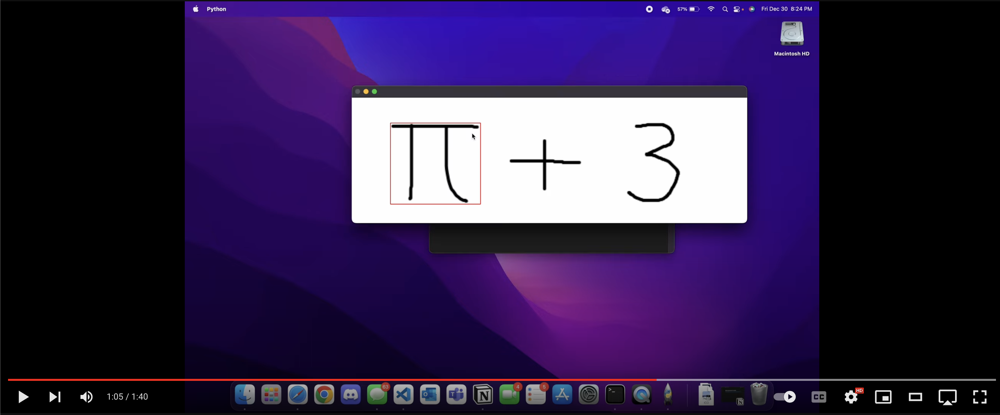
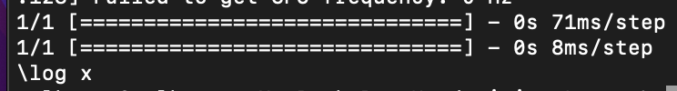
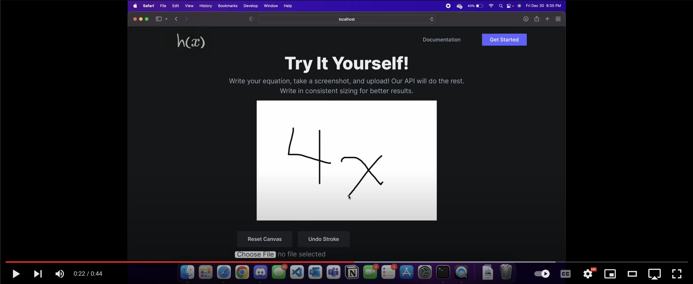
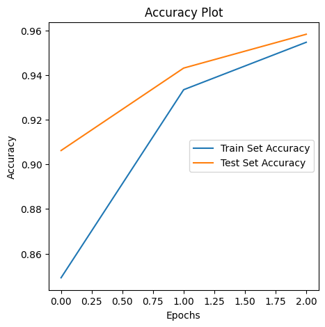
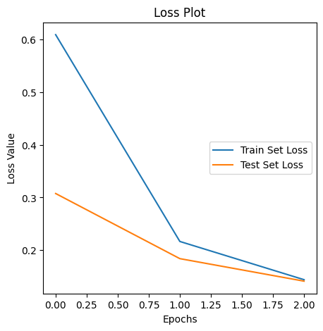

# Handtex - Converting Handwritten Mathematical Expressions into LATEX

Handtex is a React App that lets users upload their handwritten mathematical images which are fetched via API and run through a convolutional neural network to accurately predict handwritten expressions and converted to strings of LATEX.

## Demo

<div align="center">
  <a href="https://youtu.be/9XZL0-v2ImU"></a>
</div>

## How It Works

It first uses object segmentation to extract the symbols from a given expression. With these extractions (called region's of interest or ROI for short), we load and resize them to prepare them for the CNN. The model is given these resized ROI's and predicts each symbol. The predictions are translated to their equivalent LATEX form and then outputed.




## React App

<div align="center">
  <a href="https://youtu.be/_6DYXgIuj0o"></a>
</div>

## Dataset
I used the [CROHME dataset from Kaggle uploaded by Xai Nano](https://www.kaggle.com/datasets/xainano/handwrittenmathsymbols). With over 380,000 images, I utilized an 80/20 split for training/testing respectively. This dataset was trained on a convolutional neural network (CNN) which resulted in a 97% accuracy on testing data.

## Model Results

Here are graphs and results from testing the model on images its never seen before.

```python
testing_loss, testing_accuracy = model.evaluate(testing_images, testing_labels, verbose=2)
print(testing_accuracy)
```
```
1/1 - 0s - loss: 0.0925 - accuracy: 0.9688
0.96875
```





## Installation

You do not need the react app to run this project. Simply add images you wish to convert into a directory of your choosing and run the following command in the `main.py` file.

```python
main('dir/to/image') 
``` 

To run the CNN locally, download the `models` folder and load the model with the following command:

```python
import tensorflow
tensorflow.keras.models.load_model('models')
``` 

To run the React App, download the **Handtex-React** folder and run:

```bash
npm install
npm start
``` 

## Files

* `model.ipynb`: notebook of how the Keras model was created. There are explanations in the markdown of each of the steps used to create a CNN.
* `segmentation.py`: uses OpenCV contour segmentation to separate symbols when given an image with multiple symbols (expression)
* `classifier.py`: these segmented symbols are passed through our model where they are predicted/classified
* `evaluator.py`: returns the LATEX string based on the model's predictions
* `main.py`: brings it all together with Matplotlib GUI of the LATEX.
* `models/`: directory where the model is saved. You may load this model by importing tensorflow and running `tensorflow.keras.models.load_model('models')`

## Contributing

Contributions are always welcome! 
Please make sure to update tests as appropriate.
