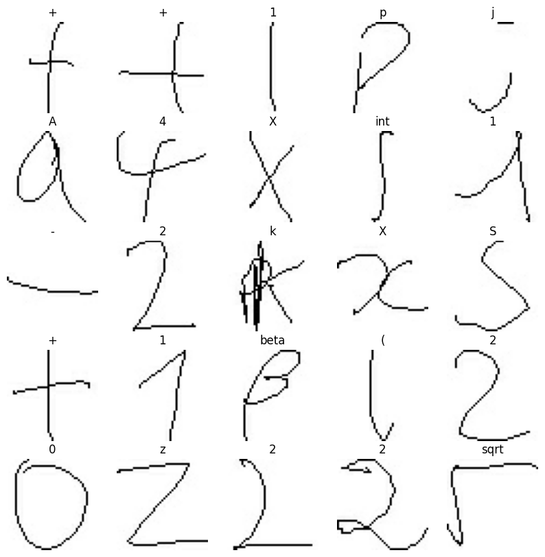
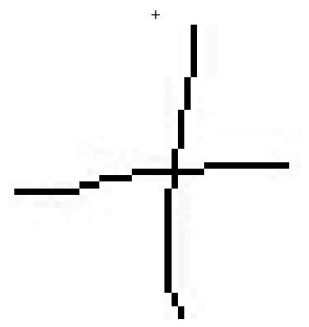

# Handwriting Latex Calculator - Gulkaran Singh

Write a mathematical expression into the GUI to convert it into Latex
and evaluate it in real time! Using the CROHME dataset, this software
uses machine learning and a convolutional neural network to parse images
to the correct Latex format.

Here are the imports needed for this project:

```python
import numpy as np
import matplotlib.pyplot as plt
import tensorflow as tf
from tensorflow.python.keras import layers, models, regularizers, initializers, optimizers
```

## Creating the Dataset

Let\'s create our dataset using a Keras utility. We will load our
dataset with some parameters and a validation split of 80% training and
20% testing/validation.

```python
data_directory = 'dataset/images'

image_height, image_width = 45, 45

# creates a training tensorflow dataset (80% split)
training_dataset = tf.keras.utils.image_dataset_from_directory(
  data_directory,
  validation_split=0.2,
  subset='training',
  seed=123,
  image_size=(image_height, image_width)
)

# creates a testing/validation tensorflow dataset (20% split)
testing_dataset = tf.keras.utils.image_dataset_from_directory(
  data_directory,
  validation_split=0.2,
  subset='validation',
  seed=123,
  image_size=(image_height, image_width)
)

# generates the class names of the datasets
class_names = training_dataset.class_names
print(class_names)
```
```
Found 375974 files belonging to 82 classes.
Using 300780 files for training.
Found 375974 files belonging to 82 classes.
Using 75194 files for validation.
['!', '(', ')', '+', ',', '-', '0', '1', '2', '3', '4', '5', '6', '7', '8', '9', '=', 'A', 'C', 'Delta', 'G', 'H', 'M', 'N', 'R', 'S', 'T', 'X', '[', ']', 'alpha', 'ascii_124', 'b', 'beta', 'cos', 'd', 'div', 'e', 'exists', 'f', 'forall', 'forward_slash', 'gamma', 'geq', 'gt', 'i', 'in', 'infty', 'int', 'j', 'k', 'l', 'lambda', 'ldots', 'leq', 'lim', 'log', 'lt', 'mu', 'neq', 'o', 'p', 'phi', 'pi', 'pm', 'prime', 'q', 'rightarrow', 'sigma', 'sin', 'sqrt', 'sum', 'tan', 'theta', 'times', 'u', 'v', 'w', 'y', 'z', '{', '}']
```


## Plotting the Dataset

With  `matplotlib.pyplot`  we can visualize the data and their
respective class names. Here is a 5x5 sample size:

```python
plt.figure(figsize=(10, 10))
for images, labels in training_dataset.take(1):
  for i in range(25):
    ax = plt.subplot(5, 5, i + 1)
    plt.imshow(images[i].numpy().astype('uint8'))
    plt.title(class_names[labels[i]])
    plt.axis('off')
```



## Converting to Numpy Array

With our usage of  `keras.utils`  to convert our images into type
 `BatchDataset` . It would be more useful if we convert these Batch
Datasets into Numpy arrays using the `.numpy()` method. We can also
normalize/standardize the data as each image has RGB channel values from
0-255. It would be more ideal for the range to be smaller (e.g 0-1) for
computation benefits.

```python
# converting training dataset
for image_batch, labels_batch in training_dataset:
  training_images, training_labels = image_batch.numpy(), labels_batch.numpy()
  break

# converting testing dataset
for image_batch, labels_batch in testing_dataset:
  testing_images, testing_labels = image_batch.numpy(), labels_batch.numpy()
  break

# normalize the pixel values to be between 0 and 1
training_images, training_labels = training_images / 255.0, training_labels / 255.0
```

Now lets try visualizing the a certain image at a given index after
we\'ve normalized the data.

Explaining the 4th line in this code (`plt.title(...)`):

-   `training_labels[image_index]` typically would return an integer
    from 0-255 but since we\'ve normalized the data it now returns a
    numpy float. If we simply rescale this value by 255, we get the
    expected index our class_name list should\'ve received. It is now
    just in type  `float`  so we convert it to an integer with  `int()`.
:::

```python
# attempt to visualize a single picture at a given index
image_index = 11
plt.imshow(training_images[image_index], cmap=plt.cm.binary)
plt.title(class_names[int(training_labels[image_index] * 255)])
plt.axis('off')
plt.show()
```



## Creating our Model

With all that initial setup, we can finally create our model! The
typical architecture for a convolutional neural network (CNN) is a stack
of 2D Convolution layers and 2D Pooling layers that provide the  `max` 
pooling operation. These layers will extract certain features from the
image which can be provided to a dense layer to attempt to classify the
image based on the features found.
:::

```python
# creating our sequential model frame
model = models.Sequential()

# creating our convolutional base
model.add(layers.Conv2D(32, (3,3), activation='relu', input_shape=(45, 45, 3)))
model.add(layers.MaxPooling2D((2,2)))
model.add(layers.Conv2D(64, (3,3), activation='relu'))
model.add(layers.MaxPooling2D((2,2)))
model.add(layers.Conv2D(64, (3,3), activation='relu'))

# creating our dense layers
model.add(layers.Flatten())
model.add(layers.Dense(448, activation='relu'))
model.add(layers.Dense(len(class_names)))

# renaming and compiling
model._name='handwriting_model'

model.compile(
  optimizer='adam',
  loss=tf.keras.losses.SparseCategoricalCrossentropy(from_logits=True),
  metrics=['accuracy'])
```

```python
model.summary()
```

```
Model: "handwriting_model"
_________________________________________________________________
Layer (type)                 Output Shape              Param #   
=================================================================
conv2d_45 (Conv2D)           (None, 43, 43, 32)        896       
_________________________________________________________________
max_pooling2d_34 (MaxPooling (None, 21, 21, 32)        0         
_________________________________________________________________
conv2d_46 (Conv2D)           (None, 19, 19, 64)        18496     
_________________________________________________________________
max_pooling2d_35 (MaxPooling (None, 9, 9, 64)          0         
_________________________________________________________________
conv2d_47 (Conv2D)           (None, 7, 7, 64)          36928     
_________________________________________________________________
flatten_15 (Flatten)         (None, 3136)              0         
_________________________________________________________________
dense_30 (Dense)             (None, 448)               1405376   
_________________________________________________________________
dense_31 (Dense)             (None, 82)                36818     
=================================================================
Total params: 1,498,514
Trainable params: 1,498,514
Non-trainable params: 0
_________________________________________________________________
```

## Training the Model

Now our model is complete, we can train our model and how well it
preforms.

```python
history = model.fit(training_dataset,
  validation_data=testing_dataset,
  epochs=3, batch_size=128)
```

```
Epoch 1/3
9400/9400 [==============================] - 159s 17ms/step - loss: 0.6091 - accuracy: 0.8492 - val_loss: 0.3076 - val_accuracy: 0.9062
Epoch 2/3
9400/9400 [==============================] - 170s 18ms/step - loss: 0.2166 - accuracy: 0.9334 - val_loss: 0.1839 - val_accuracy: 0.9431
Epoch 3/3
9400/9400 [==============================] - 163s 17ms/step - loss: 0.1440 - accuracy: 0.9546 - val_loss: 0.1412 - val_accuracy: 0.9582
```

## Testing the Model

Now, we\'ll evaluate the models preformance on images its never seen
before (testing dataset)

```python
testing_loss, testing_accuracy = model.evaluate(testing_images, testing_labels, verbose=2)
print(testing_accuracy)
```
```
1/1 - 0s - loss: 0.0925 - accuracy: 0.9688
0.96875
```

## Visualizing our Results

```python
figure = plt.figure(figsize=(5, 5))
plt.plot(history.history['accuracy'], label='Train Set Accuracy')
plt.plot(history.history['val_accuracy'], label='Test Set Accuracy')
plt.title('Accuracy Plot')
plt.xlabel('Epochs')
plt.ylabel('Accuracy')
plt.legend(loc='upper right')
plt.show()

figure2 = plt.figure(figsize=(5, 5))
plt.plot(history.history['loss'], label='Train Set Loss')
plt.plot(history.history['val_loss'], label='Test Set Loss')
plt.title('Loss Plot')
plt.xlabel('Epochs')
plt.ylabel('Loss Value')
plt.legend(loc='upper right')
plt.show()
```


## Saving the Model

```python
model.save('my_model.h5')
```
